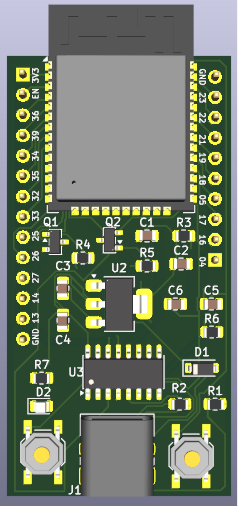
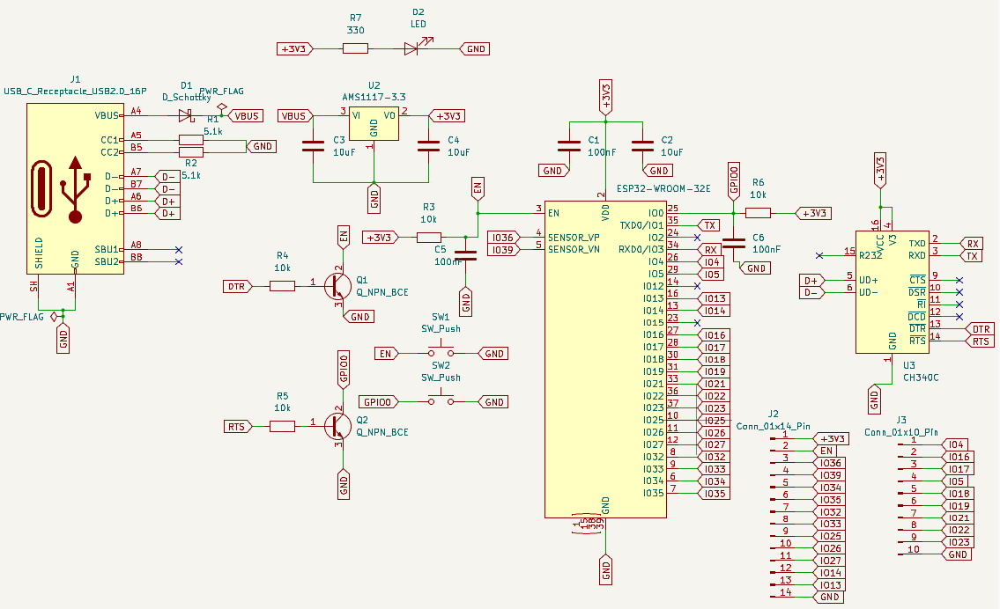
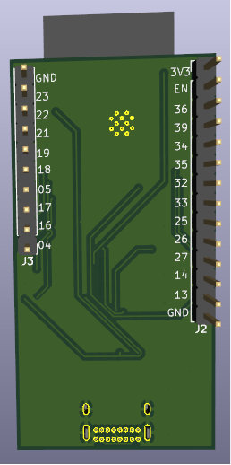
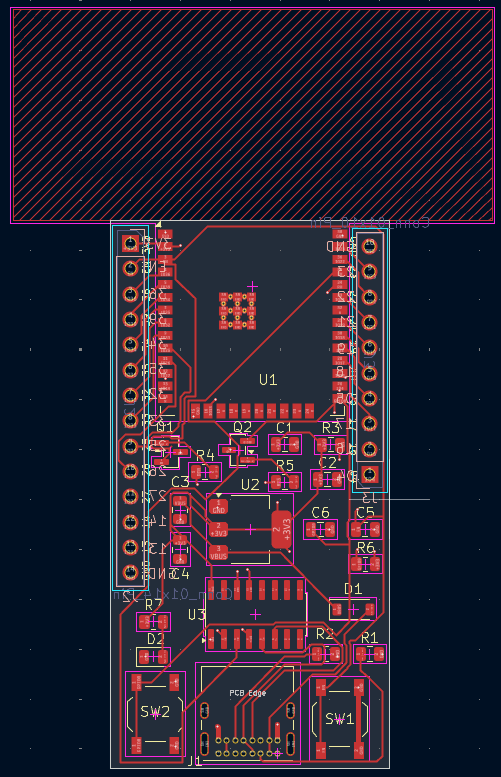

# NEXUS-ESP32-DevKit



Placa de desarrollo basada en el módulo **ESP32-WROOM-32E**, diseñada desde cero en **KiCad 10** como proyecto de ingeniería de hardware. El objetivo no fue copiar una placa existente, sino recorrer el flujo completo de diseño profesional —desde el esquemático hasta los archivos de fabricación— documentando y justificando cada decisión técnica.

## Características

- **Entrada USB-C** con resistencias pull-down de 5.1kΩ en CC1/CC2 para la negociación de corriente del estándar Type-C (sin ellas, un cargador USB-C no habilita VBUS)
- **Protección contra inversión de polaridad** mediante diodo Schottky en serie (SS14), elegido por su baja caída de voltaje (~0.3-0.5V) para preservar el margen de dropout del regulador
- **Regulación 5V → 3.3V** con LDO AMS1117-3.3 y capacitores de entrada/salida de 10µF según datasheet
- **USB-UART CH340C** configurado en modo 3.3V (V3 puenteado a VCC), eliminando la necesidad de conversión de niveles con el ESP32
- **Circuito de auto-reset** (DTR/RTS con dos transistores NPN 2N3904) para programación automática desde Arduino IDE / PlatformIO sin presionar botones
- **Botones físicos BOOT y RESET** como respaldo manual
- **LED indicador de encendido** (330Ω, calculado por Ley de Ohm para ~4mA)
- **24 GPIOs expuestos en headers** — únicamente pines seguros
- **PCB de 2 capas, 28 × 55 mm** (formato DevKit comercial), con plano de tierra completo en la capa inferior
- Serigrafía con **pinout etiquetado en ambas caras**

## Decisiones de diseño destacadas

**Selección de pines expuestos.** Se excluyeron deliberadamente de los headers: IO0 (en uso por el circuito de boot), IO1/IO3 (UART del CH340C), IO2/IO12/IO15 (pines de *strapping* que pueden impedir el arranque si reciben conexiones externas) y GPIO6-11 (flash SPI interna). El resultado: cualquier pin expuesto puede usarse sin riesgo de conflicto. Los pines IO34-IO39 están documentados como solo-entrada.

**Alimentación del CH340C.** El chip admite operación a 5V o 3.3V. Se eligió el modo 3.3V (puente V3-VCC) para que toda la lógica de la placa trabaje en un solo dominio de voltaje, simplificando el diseño y evitando conversiones de nivel en las líneas TX/RX.

**Plano de tierra.** En lugar de rutear GND como pistas individuales, se implementó una zona de cobre en B.Cu conectada mediante vías desde cada pad SMD. Se verificó la continuidad del plano reorganizando las pistas de la capa inferior para evitar islas aisladas.

**Reglas de diseño ajustadas a los footprints reales.** El pitch fino del conector USB-C y las vías térmicas del pad central del ESP32 requirieron ajustar el clearance mínimo a 0.15mm y el agujero pasante mínimo a 0.2mm — ambos dentro de las capacidades estándar de fabricantes como JLCPCB.

## Verificación

- **ERC (esquemático): 0 errores** — incluyendo resolución de PWR_FLAGs en redes de alimentación y exclusión documentada de la falsa alarma V3/VO del símbolo del CH340C
- **DRC (PCB): 0 errores** — con alivios térmicos reforzados en los pads GND del conector y márgenes al borde de placa respetados

## Estructura del repositorio

```
NEXUS-ESP32-DevKit/
├── NEXUS-ESP32-DevKit.kicad_pro    # Proyecto KiCad
├── NEXUS-ESP32-DevKit.kicad_sch    # Esquemático
├── NEXUS-ESP32-DevKit.kicad_pcb    # Layout de PCB
├── fabrication/                     # Gerbers y archivos de taladrado
├── images/                          # Renders 3D, esquemático, layout
└── README.md
```

## Galería

| Esquemático | Layout | Render 3D |
|---|---|---|
|  |  |  |

## Herramientas

- **KiCad 10** — captura esquemática, layout, verificación ERC/DRC, generación de Gerbers
- **Git / GitHub** — control de versiones con historial de commits documentando cada bloque de diseño

## Estado del proyecto

✅ Esquemático completo y verificado
✅ Layout de PCB ruteado y verificado
✅ Archivos de fabricación generados
⬜ Fabricación y ensamblado (opcional, próxima etapa)
⬜ Firmware de prueba de periféricos (post-fabricación)

---

**Autor:** Nicolás Gómez — Ingeniero Electrónico
GitHub: [@ngomez328](https://github.com/ngomez328)
